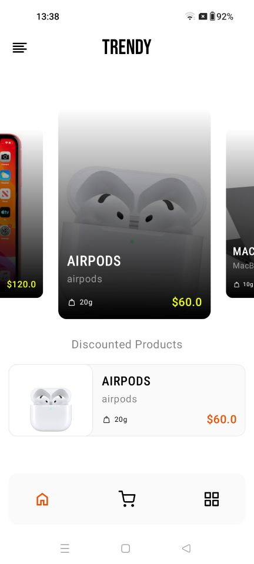
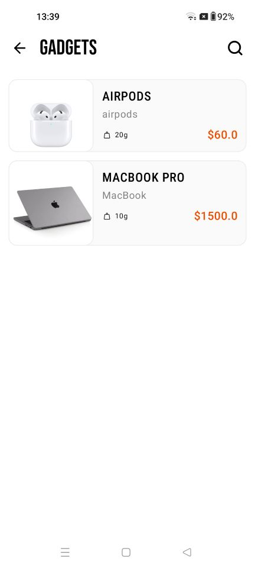
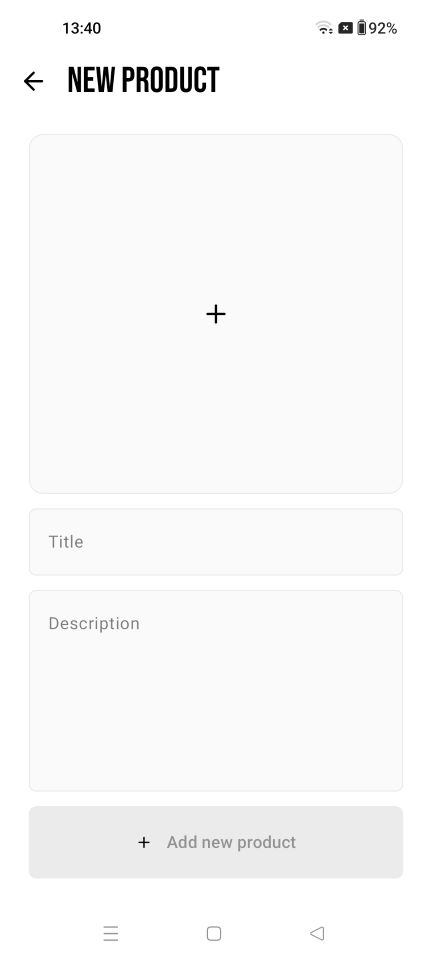
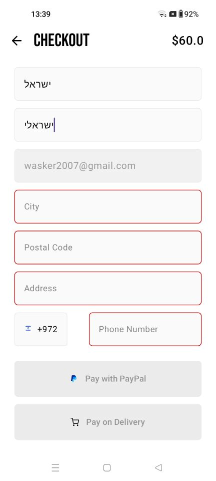
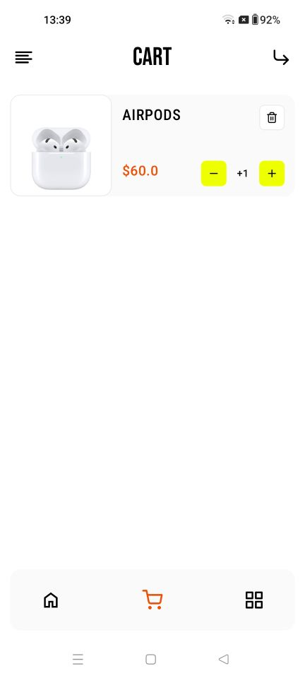
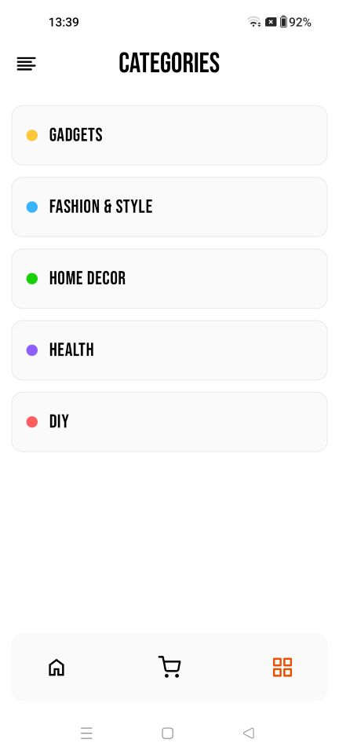

# Trendy

A Kotlin Multiplatform (KMP) project targeting Android and iOS, offering shared UI and business logic.

---

## Table of Contents

- [Introduction](#introduction)
- [Features](#features)
- [Tech Stack](#tech-stack)
- [Screenshots](#Screenshots)
- [Project Structure](#project-structure)
- [Getting Started](#getting-started)

---

## Introduction
Trendy is Kotlin Multiplatform e-commerce application that sell Trending products , built for Android and iOS.

Trendy is a modern mobile application built using Kotlin Multiplatform (KMP). It allows you to share code between Android and iOS platforms, including UI via Compose Multiplatform as well as shared business logic. The goal is to reduce duplication, speed up development, and ensure consistency across platforms.

---

## Features

- Shared business logic across Android and iOS
- Shared UI components using Compose Multiplatform
- Platform‑specific entry points (Android, iOS) with integration to native frameworks as needed
- Modular architecture: separation of data, DI (dependency injection), navigation, features, etc.
- Integrate Firebase (auth, database, storage, push notifications) and PayPal payments.
- Apply clean architecture and MVVM patterns to ensure scalable and maintainable code.
---

## Tech Stack

| Layer | Technology / Framework                                                            |
|---|-----------------------------------------------------------------------------------|
| Language | Kotlin (Multiplatform) + Swift (for iOS entry where required)                     |
| UI | Compose Multiplatform                                                             |
| Dependency Injection | Koin                                                                              |
| Build System | Gradle                                                                |
| Platforms | Android, iOS                                                                      |
| Navigation | Shared/navigation module                                                          |

---

## Project Structure

Here’s the high‑level layout of the repository:

```
/
├── composeApp/             # Shared Compose Multiplatform UI code
│   ├── commonMain/
│   ├── androidMain/
│   └── iosMain/
├── iosApp/                 # iOS application entry point (Swift/SwiftUI or native host)
├── feature/                # Feature modules (specific app features)
├── data/                   # Shared / platform data sources, repositories
├── di/                     # Dependency Injection setup
├── navigation/             # Shared navigation logic
└── shared/                 # Shared Resources
```

- **composeApp**: Contains UI that is shared using Compose Multiplatform. It has subfolders for `commonMain`, `androidMain`, `iosMain` etc.
- **iosApp**: The iOS application; even when much UI is shared, the iOS target needs an entry point (e.g. handling of iOS lifecycle, possibly some SwiftUI or bridging).
- **feature**: Encapsulates individual app features or screens, likely used by the shared UI.
- **data**: Data layer — repositories, models, network/local data sources shared or platform‑specific.
- **di**: Dependency injection configuration.
- **navigation**: Manages routes / navigation between screens in a platform‑agnostic/shared way.
- **shared**: Common utilities, models, business logic etc.

---
## Screenshots

## Homepage Screen
<br><br>

## Gadgets Category
<br><br>

## Create Product Screen
<br><br>

## Checkout Screen
<br><br>

## Cart Screen
<br><br>

## Categories Screen
<br><br>

---

## Getting Started

These steps will get you a copy of the project up and running on your local machine.

### Prerequisites

- JDK 11 or later
- Kotlin Multiplatform plugin support
- Android Studio (for Android target)
- Xcode (for iOS target)
- Proper setup of SDKs for Android and iOS

### Clone the Repository

```bash
git clone https://github.com/roywasker/Trendy.git
cd Trendy
```

### Build & Run

**Android**

1. Open the project in Android Studio.
2. Let Gradle sync.
3. Run the Android module / app via Android emulator or device.

**iOS**

1. Open the `iosApp` target in Xcode.
2. Ensure that the `composeApp` shared code is properly linked / included.
3. Build and run on an iOS simulator or device.